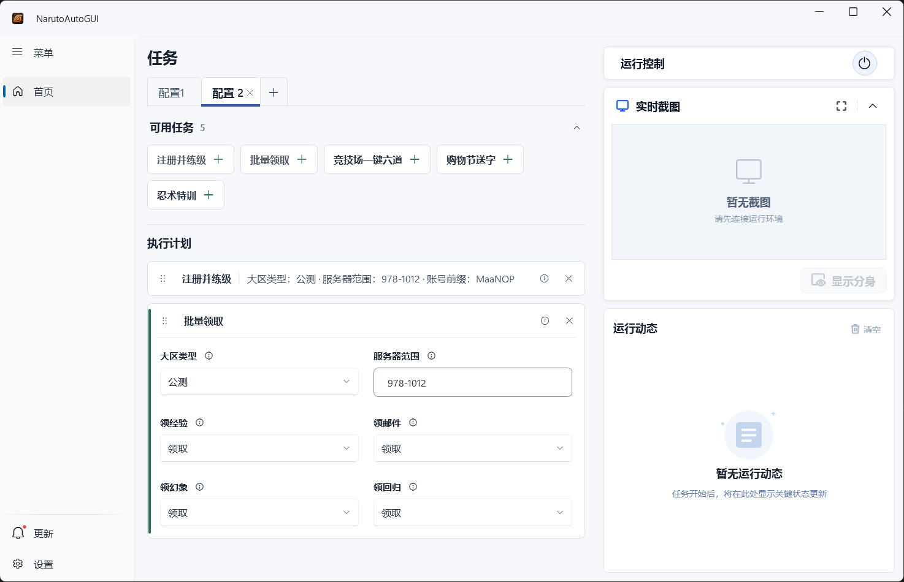
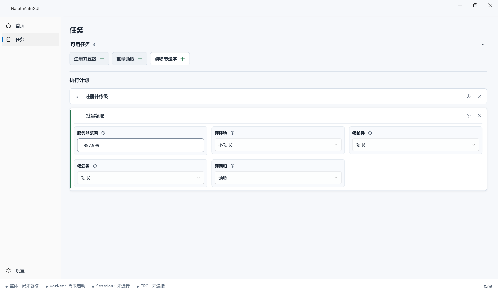

# NarutoAutoGUI

NarutoAutoGUI 是 MaaNOP 的 Windows GUI，通过独立 Windows Session 运行火影忍者 Online 自动化，使游戏可以在后台持续运行，而不长期占用当前桌面和鼠标。

## 界面预览

Dashboard 页面：



Tasks 页面：



## 主要功能

- 创建并管理独立的 Windows Child Session，让游戏在后台 Session 中持续运行。
- 在 Dashboard 查看当前任务、运行状态、MaaNOP `focus` 日志和运行中的游戏画面预览。
- 从 MaaNOP Project Interface 选择任务，并动态编辑任务提供的 input、switch 和 select 参数。
- 通过 Child Session 中的 NarutoAutoWorker、MaaFramework 和 MaaNOP 执行任务。
- 使用首页的上下文操作完成运行环境准备、任务开始和任务停止。
- 从首页打开、隐藏或结束完整的 Child Session 桌面。
- 关闭主窗口后驻留系统托盘，并从托盘恢复窗口或安全退出。
- 自动读取与 `NarutoAutoGUI.exe` 同级的 bundled `interface.json`，无需选择 MaaNOP 项目目录。
- 自动解析当前用户的 QQMicroGameBox 启动器，使用固定的火影忍者 Online AppId `1103286479`，无需填写游戏路径或启动参数。

## 快速开始

1. 前往 [MaaNOP Releases](https://github.com/ArcherSore/MaaNOP/releases) 下载完整的 Windows x64 ZIP。
2. 解压整个 ZIP，不要只复制其中的可执行文件。
3. 确保 QQ 游戏平台已经安装过火影忍者 Online 微端。
4. 运行 `NarutoAutoGUI.exe`，并在 Windows 提示时允许管理员权限。
5. 在首页点击“准备运行环境”。
6. 在打开的完整桌面中完成必要的游戏登录。
7. 在“任务”页选择任务并配置参数，然后回到首页开始任务。

NarutoAutoGUI 会从完整发布包中自动读取 `interface.json`，并自动确定 QQMicroGameBox 启动器路径、启动参数和 AppId；这些路径和参数不需要用户配置。

## 运行要求

### 使用 Release

- Windows x64，以及可交互的 Windows 桌面。
- 管理员权限；启动时会显示 UAC 提示。
- 已通过 QQ 游戏平台安装或至少启动过一次火影忍者 Online 微端。
- 完整的 MaaNOP Windows x64 发布包，其中应包含 `interface.json`、Agent 和项目资源。
- 系统中可用的 `python` 命令，以及 MaaNOP Agent 所需的 `maa` Python 模块。

完整发布包中的 NarutoAutoGUI、NarutoAutoWorker、.NET runtime 和 MaaFramework runtime 均为自包含内容。Release 用户不需要安装 .NET SDK，也不需要单独配置 `interface.json`、游戏启动路径、启动参数或 AppId。

本仓库单独生成的 NarutoAutoGUI frontend ZIP 用于 MaaNOP Windows 包组合，包含 GUI、Worker 和固定 MaaFramework runtime，但不包含 MaaNOP 项目资源或 Python runtime；直接运行任务时请使用上述完整 MaaNOP Windows x64 发布包。

### 开发者本地构建

完整构建需要 Windows x64 和 .NET 10 SDK。在仓库根目录运行：

```powershell
.\src\NarutoAutoGUI\scripts\build.ps1
```

发布结果位于 `artifacts\NarutoAutoGUI\win-x64`。无需 UAC、RDP 或真实游戏的自动自检：

```powershell
.\src\NarutoAutoGUI\scripts\test-automated.ps1
```

## 工作方式

```text
Main Windows Session
└─ NarutoAutoGUI

Child Session
└─ NarutoAutoWorker
   └─ 火影忍者 Online
      └─ MaaFramework / MaaNOP
```

NarutoAutoGUI 留在当前桌面负责配置、预览和控制；Worker、游戏与自动化流程运行在独立 Child Session 中。隐藏完整桌面或主窗口不会结束后台任务。

详细技术设计见 [架构文档](docs/ARCHITECTURE.md)。当前能力与后续方向分别记录在 [STATUS](docs/STATUS.md) 和 [ROADMAP](docs/ROADMAP.md)。正式 GUI 的开发说明见 [src/NarutoAutoGUI/README.md](src/NarutoAutoGUI/README.md)。
